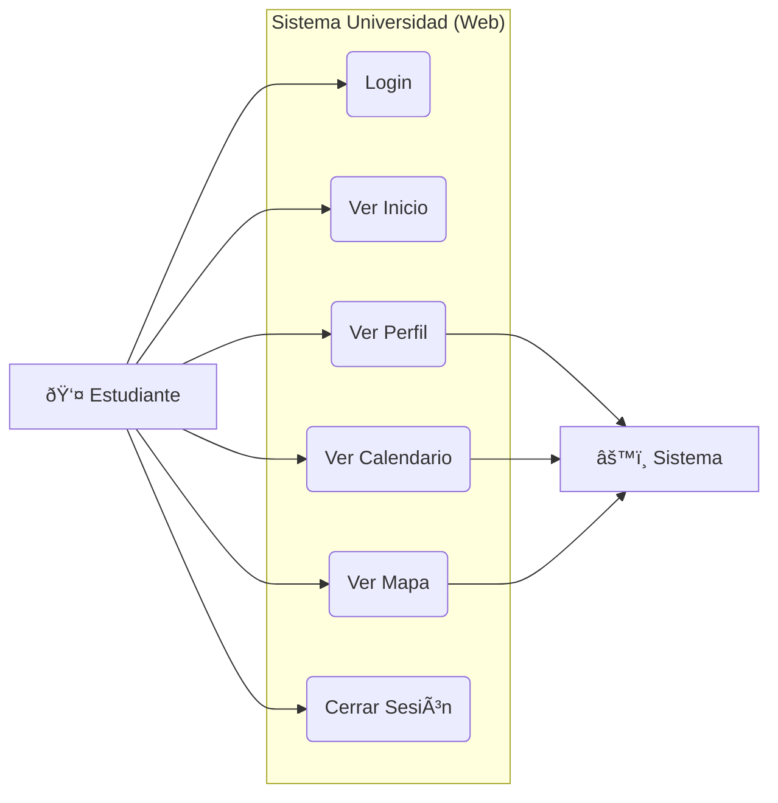

# Diagrama de Casos de Uso

```mermaid
graph LR
    A["👤 Estudiante"]
    
    subgraph Sistema["Sistema Universidad (Web)"]
        UC1("Login")
        UC2("Ver Inicio")
        UC3("Ver Perfil")
        UC4("Ver Calendario")
        UC5("Ver Mapa")
        UC6("Cerrar Sesión")
    end
    
    B["âš™ï¸ Sistema"]
    
    A --> UC1
    A --> UC2
    A --> UC3
    A --> UC4
    A --> UC5
    A --> UC6
    
    UC3 --> B
    UC4 --> B
    UC5 --> B
```
