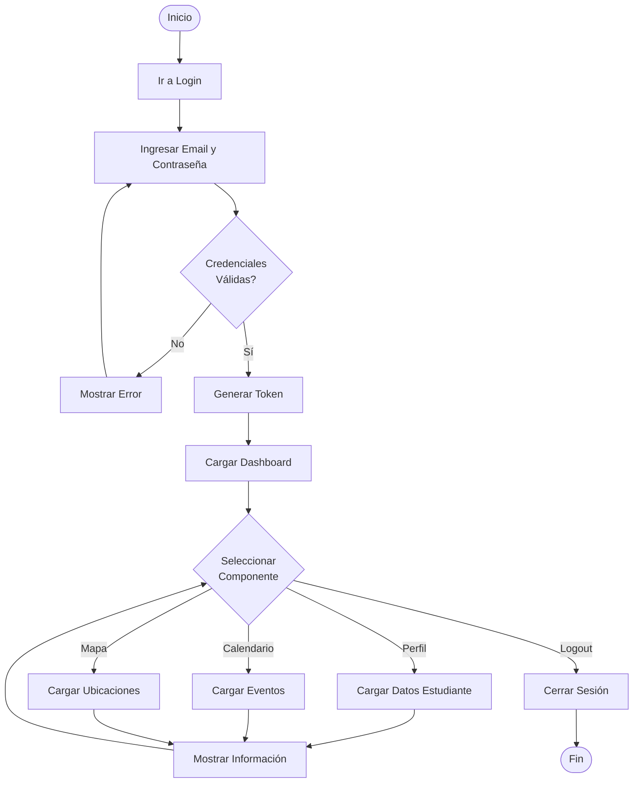

# Diagrama de Actividades

```mermaid
flowchart TD
    A([Inicio]) --> B[Ir a Login]
    B --> C[Ingresar Email y Contraseña]
    C --> D{Credenciales<br/>Válidas?}
    D -->|No| E[Mostrar Error]
    E --> C
    D -->|Sí| F[Generar Token]
    F --> G[Cargar Dashboard]
    G --> H{Seleccionar<br/>Componente}
    H -->|Perfil| I[Cargar Datos Estudiante]
    H -->|Calendario| J[Cargar Eventos]
    H -->|Mapa| K[Cargar Ubicaciones]
    I --> L[Mostrar Información]
    J --> L
    K --> L
    L --> H
    H -->|Logout| M[Cerrar Sesión]
    M --> N([Fin])
```

