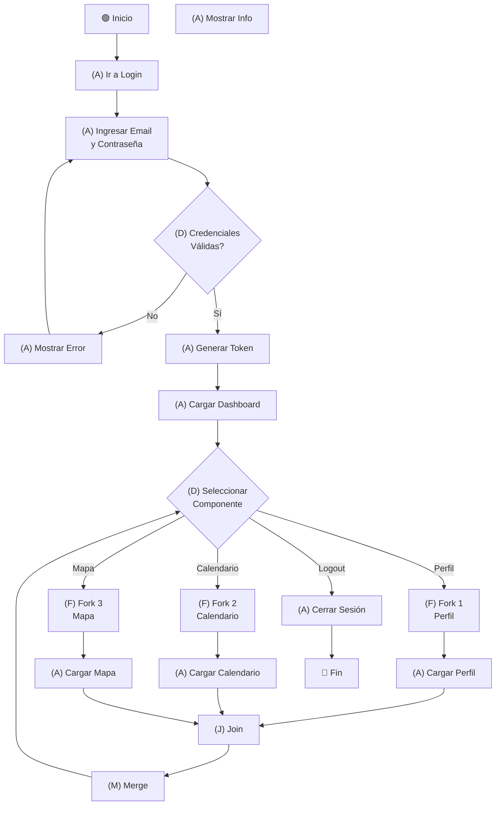

# Diagrama de Actividades Mejorado

```mermaid
graph TD
    A[🟢 Inicio]
    B["(A) Ir a Login"]
    C["(A) Ingresar Email<br/>y Contraseña"]
    D{"(D) Credenciales<br/>Válidas?"}
    E["(A) Mostrar Error"]
    F["(A) Generar Token"]
    G["(A) Cargar Dashboard"]
    H{"(D) Seleccionar<br/>Componente"}
    I["(A) Cargar Perfil"]
    J["(A) Cargar Calendario"]
    K["(A) Cargar Mapa"]
    L["(A) Mostrar Info"]
    M["(A) Cerrar Sesión"]
    N["(F) Fork 1<br/>Perfil"]
    O["(F) Fork 2<br/>Calendario"]
    P["(F) Fork 3<br/>Mapa"]
    Q["(J) Join"]
    R["(M) Merge"]
    S["🔴 Fin"]
    
    A --> B
    B --> C
    C --> D
    D -->|No| E
    E --> C
    D -->|Sí| F
    F --> G
    G --> H
    
    H -->|Perfil| N
    H -->|Calendario| O
    H -->|Mapa| P
    H -->|Logout| M
    
    N --> I
    O --> J
    P --> K
    
    I --> Q
    J --> Q
    K --> Q
    
    Q --> R
    R --> H
    
    M --> S
```