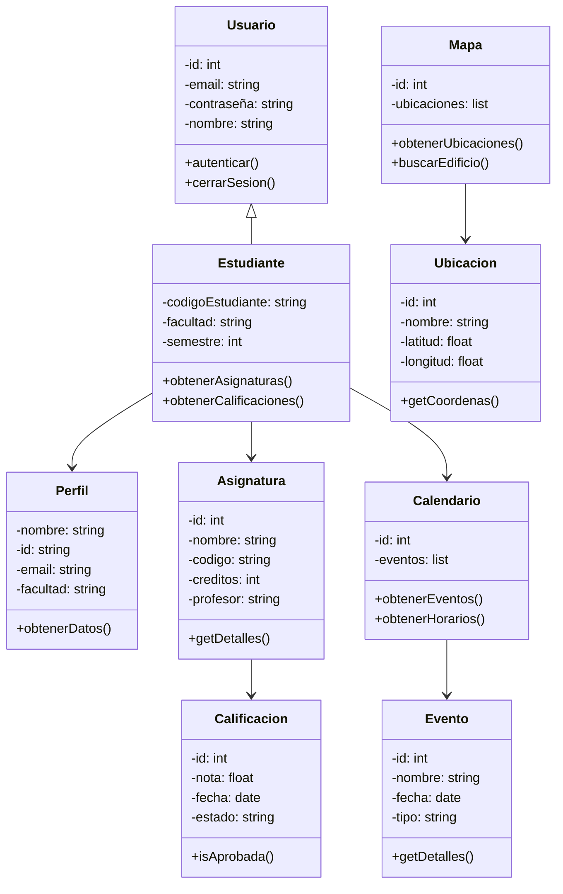

# Diagrama de Clases

```mermaid
classDiagram
    class Usuario {
        -id: int
        -email: string
        -contraseña: string
        -nombre: string
        +autenticar()
        +cerrarSesion()
    }
    
    class Estudiante {
        -codigoEstudiante: string
        -facultad: string
        -semestre: int
        +obtenerAsignaturas()
        +obtenerCalificaciones()
    }
    
    class Perfil {
        -nombre: string
        -id: string
        -email: string
        -facultad: string
        +obtenerDatos()
    }
    
    class Asignatura {
        -id: int
        -nombre: string
        -codigo: string
        -creditos: int
        -profesor: string
        +getDetalles()
    }
    
    class Calificacion {
        -id: int
        -nota: float
        -fecha: date
        -estado: string
        +isAprobada()
    }
    
    class Calendario {
        -id: int
        -eventos: list
        +obtenerEventos()
        +obtenerHorarios()
    }
    
    class Evento {
        -id: int
        -nombre: string
        -fecha: date
        -tipo: string
        +getDetalles()
    }
    
    class Mapa {
        -id: int
        -ubicaciones: list
        +obtenerUbicaciones()
        +buscarEdificio()
    }
    
    class Ubicacion {
        -id: int
        -nombre: string
        -latitud: float
        -longitud: float
        +getCoordenas()
    }
    
    Usuario <|-- Estudiante
    Estudiante --> Perfil
    Estudiante --> Asignatura
    Asignatura --> Calificacion
    Estudiante --> Calendario
    Calendario --> Evento
    Mapa --> Ubicacion
```

