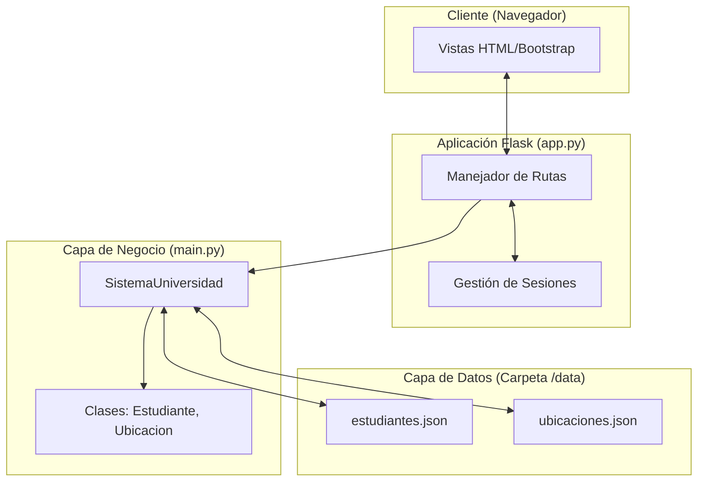

# Diagrama de Componentes

```mermaid
graph TB
    subgraph Cliente["Cliente (Navegador)"]
        UI[Vistas HTML/Bootstrap]
    end
    
    subgraph Aplicacion["Aplicación Flask (app.py)"]
        Routes[Manejador de Rutas]
        Session[Gestión de Sesiones]
    end
    
    subgraph Logica["Capa de Negocio (main.py)"]
        Sistema[SistemaUniversidad]
        Modelos[Clases: Estudiante, Ubicacion]
    end
    
    subgraph Persistencia["Capa de Datos (Carpeta /data)"]
        JSON_E[estudiantes.json]
        JSON_U[ubicaciones.json]
    end
    
    UI <--> Routes
    Routes <--> Session
    Routes --> Sistema
    Sistema --> Modelos
    Sistema <--> JSON_E
    Sistema <--> JSON_U
```

