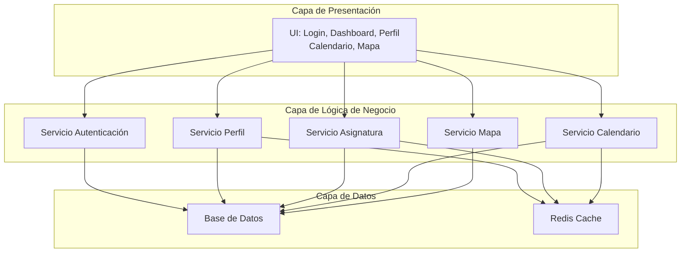

# Diagrama de Componentes

```mermaid
graph TB
    subgraph Presentacion["Capa de Presentación"]
        UI[UI: Login, Dashboard, Perfil<br/>Calendario, Mapa]
    end
    
    subgraph Logica["Capa de Lógica de Negocio"]
        Auth[Servicio Autenticación]
        Perfil[Servicio Perfil]
        Asignatura[Servicio Asignatura]
        Calendario[Servicio Calendario]
        Mapa[Servicio Mapa]
    end
    
    subgraph Datos["Capa de Datos"]
        BD[Base de Datos]
        Cache[Redis Cache]
    end
    
    UI --> Auth
    UI --> Perfil
    UI --> Asignatura
    UI --> Calendario
    UI --> Mapa
    
    Auth --> BD
    Perfil --> BD
    Asignatura --> BD
    Calendario --> BD
    Mapa --> BD
    
    Perfil --> Cache
    Asignatura --> Cache
    Calendario --> Cache
```

