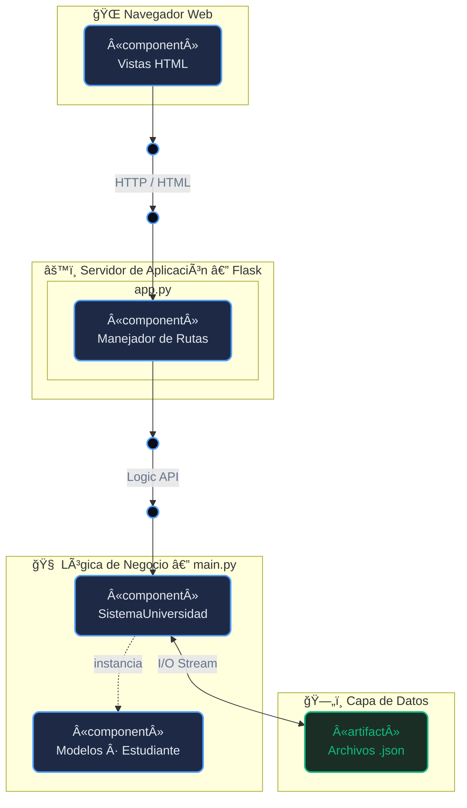

# Diagrama de Componentes

```mermaid
graph TB
    %% ── Estilos ──────────────────────────────────────────
    classDef comp     fill:#1e2a45,stroke:#4f9eff,stroke-width:2px,color:#e2e8f0,rx:8
    classDef artifact fill:#1a2e25,stroke:#10b981,stroke-width:2px,color:#10b981,rx:8
    classDef iface    fill:#0a0e1a,stroke:#4f9eff,stroke-width:2px,color:#4f9eff
    classDef label    fill:none,stroke:none,color:#64748b

    %% ── Cliente ──────────────────────────────────────────
    subgraph Cliente["🌠Navegador Web"]
        UI["«component»\nVistas HTML"]:::comp
    end

    %% ── Interfaces HTTP ──────────────────────────────────
    UI --> HTTP_S((" ")):::iface
    HTTP_S -->|HTTP / HTML| HTTP_R((" ")):::iface

    %% ── Servidor Flask ───────────────────────────────────
    subgraph Servidor["âš™ï¸ Servidor de Aplicación — Flask"]
        subgraph AppPy["app.py"]
            Routes["«component»\nManejador de Rutas"]:::comp
        end
    end

    HTTP_R --> Routes

    %% ── Interfaces Logic API ─────────────────────────────
    Routes --> LOG_S((" ")):::iface
    LOG_S -->|Logic API| LOG_R((" ")):::iface

    %% ── Lógica de negocio ────────────────────────────────
    subgraph Logica["🧠 Lógica de Negocio — main.py"]
        Sistema["«component»\nSistemaUniversidad"]:::comp
        Modelos["«component»\nModelos · Estudiante"]:::comp
    end

    LOG_R --> Sistema
    Sistema -. "instancia" .-> Modelos

    %% ── Capa de datos ────────────────────────────────────
    subgraph Datos["ğŸ—„ï¸ Capa de Datos"]
        JSON["«artifact»\nArchivos .json"]:::artifact
    end

    Sistema <-->|"I/O Stream"| JSON
```

