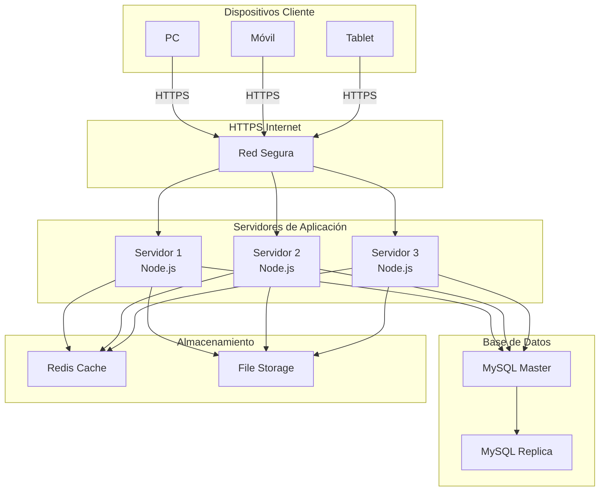

# Diagrama de Despliegue

```mermaid
graph TB
    subgraph Clientes["Dispositivos Cliente"]
        PC[PC]
        Mobile[Móvil]
        Tablet[Tablet]
    end
    
    subgraph Internet["HTTPS Internet"]
        Net[Red Segura]
    end
    
    subgraph Servidores["Servidores de Aplicación"]
        S1[Servidor 1<br/>Node.js]
        S2[Servidor 2<br/>Node.js]
        S3[Servidor 3<br/>Node.js]
    end
    
    subgraph BaseDatos["Base de Datos"]
        Master[MySQL Master]
        Replica[MySQL Replica]
    end
    
    subgraph Almacenamiento["Almacenamiento"]
        Cache[Redis Cache]
        Files[File Storage]
    end
    
    PC -->|HTTPS| Net
    Mobile -->|HTTPS| Net
    Tablet -->|HTTPS| Net
    
    Net --> S1
    Net --> S2
    Net --> S3
    
    S1 --> Master
    S2 --> Master
    S3 --> Master
    
    Master --> Replica
    
    S1 --> Cache
    S2 --> Cache
    S3 --> Cache
    
    S1 --> Files
    S2 --> Files
    S3 --> Files
```

