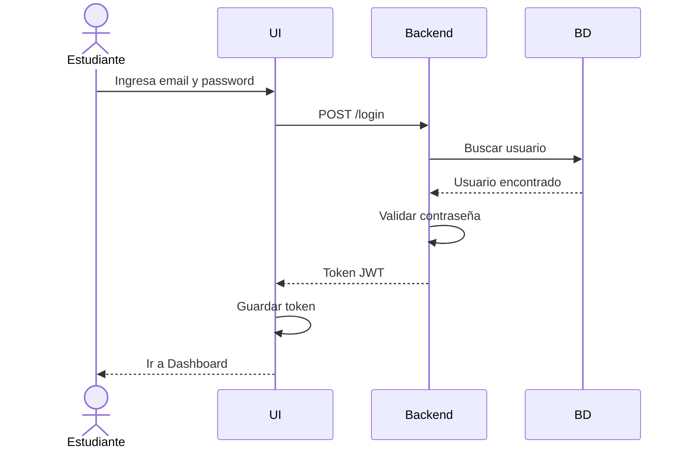
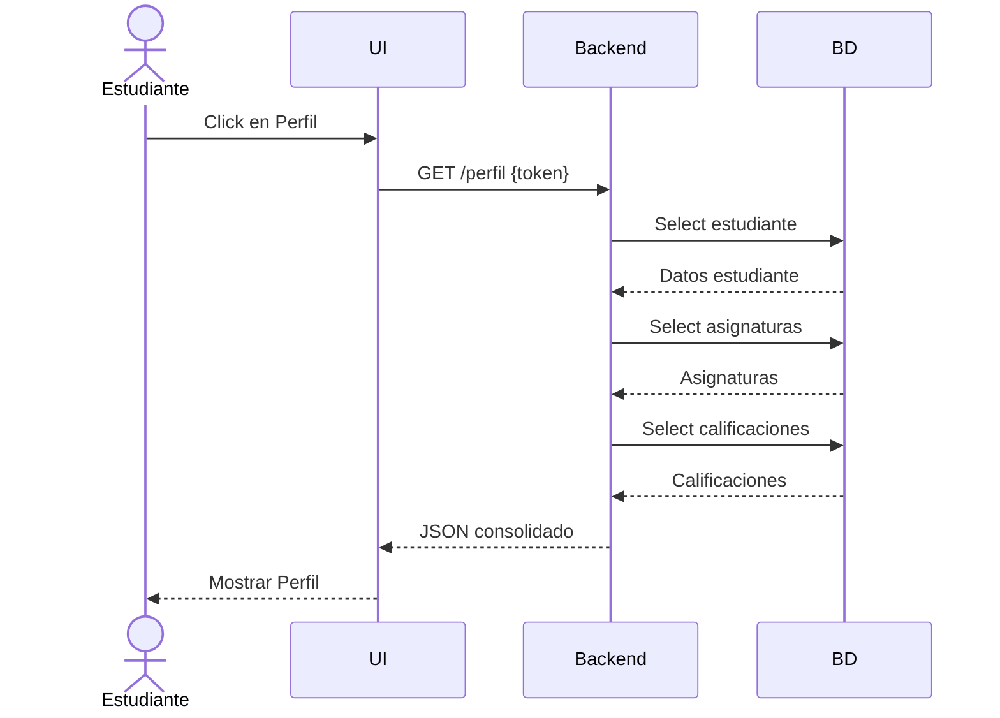
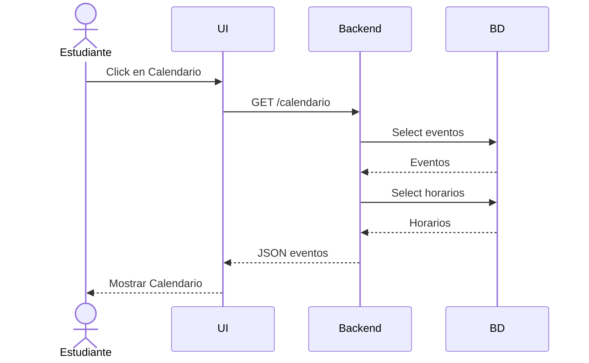
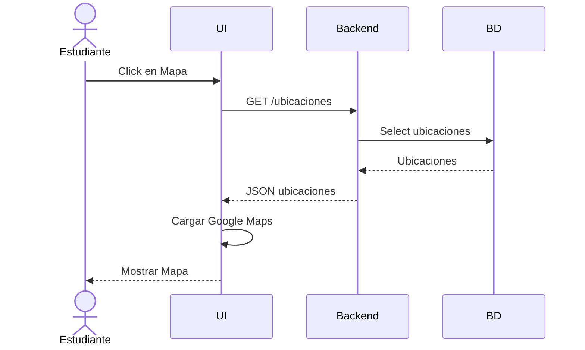
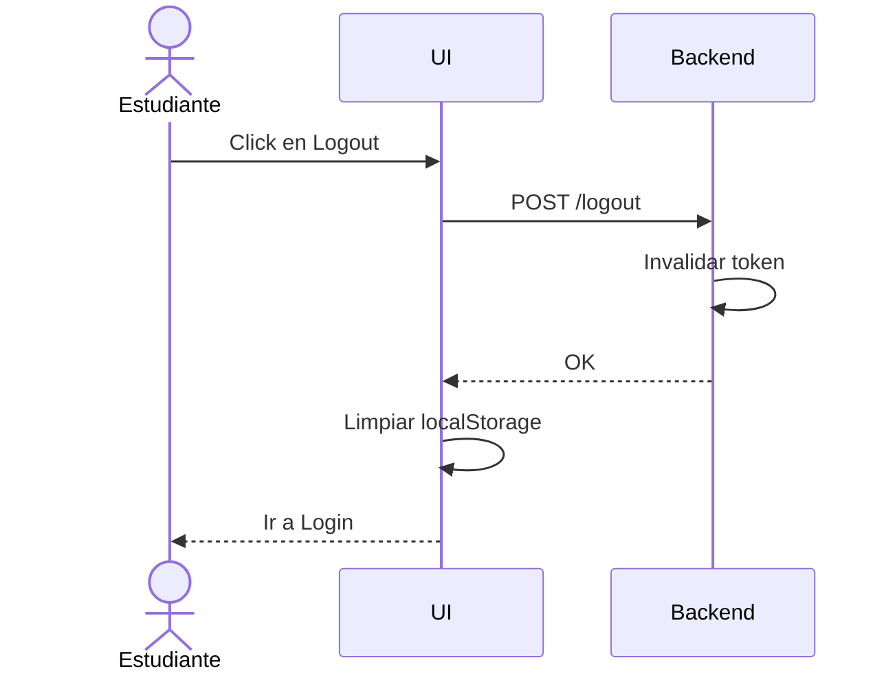

# Diagrama de Secuencia

## Secuencia 1: Login

```mermaid
sequenceDiagram
    actor Estudiante
    participant UI
    participant Backend
    participant BD
    
    Estudiante->>UI: Ingresa email y password
    UI->>Backend: POST /login
    Backend->>BD: Buscar usuario
    BD-->>Backend: Usuario encontrado
    Backend->>Backend: Validar contraseña
    Backend-->>UI: Token JWT
    UI->>UI: Guardar token
    UI-->>Estudiante: Ir a Dashboard
```

## Secuencia 2: Ver Perfil

```mermaid
sequenceDiagram
    actor Estudiante
    participant UI
    participant Backend
    participant BD
    
    Estudiante->>UI: Click en Perfil
    UI->>Backend: GET /perfil {token}
    Backend->>BD: Select estudiante
    BD-->>Backend: Datos estudiante
    Backend->>BD: Select asignaturas
    BD-->>Backend: Asignaturas
    Backend->>BD: Select calificaciones
    BD-->>Backend: Calificaciones
    Backend-->>UI: JSON consolidado
    UI-->>Estudiante: Mostrar Perfil
```

## Secuencia 3: Ver Calendario

```mermaid
sequenceDiagram
    actor Estudiante
    participant UI
    participant Backend
    participant BD
    
    Estudiante->>UI: Click en Calendario
    UI->>Backend: GET /calendario
    Backend->>BD: Select eventos
    BD-->>Backend: Eventos
    Backend->>BD: Select horarios
    BD-->>Backend: Horarios
    Backend-->>UI: JSON eventos
    UI-->>Estudiante: Mostrar Calendario
```

## Secuencia 4: Ver Mapa

```mermaid
sequenceDiagram
    actor Estudiante
    participant UI
    participant Backend
    participant BD
    
    Estudiante->>UI: Click en Mapa
    UI->>Backend: GET /ubicaciones
    Backend->>BD: Select ubicaciones
    BD-->>Backend: Ubicaciones
    Backend-->>UI: JSON ubicaciones
    UI->>UI: Cargar Google Maps
    UI-->>Estudiante: Mostrar Mapa
```

## Secuencia 5: Logout

```mermaid
sequenceDiagram
    actor Estudiante
    participant UI
    participant Backend
    
    Estudiante->>UI: Click en Logout
    UI->>Backend: POST /logout
    Backend->>Backend: Invalidar token
    Backend-->>UI: OK
    UI->>UI: Limpiar localStorage
    UI-->>Estudiante: Ir a Login
```

