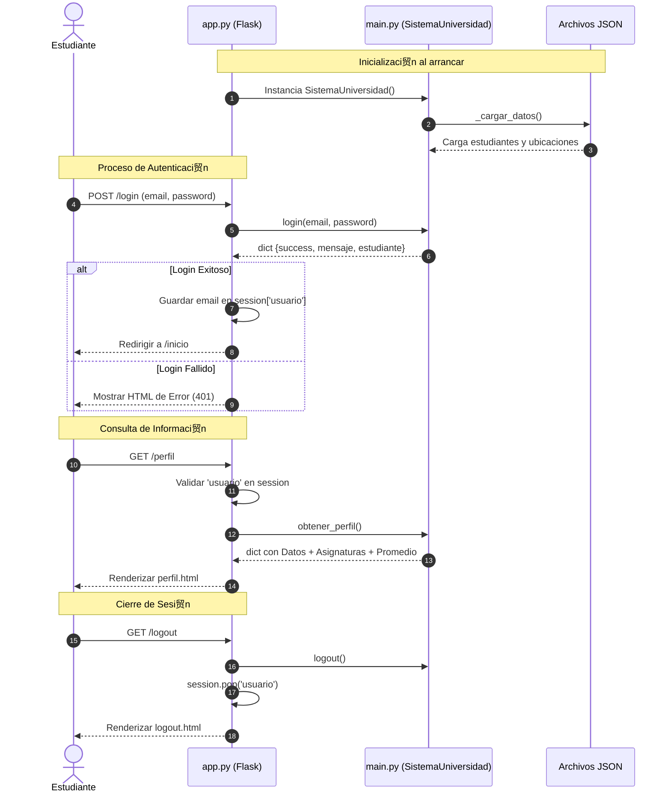

# Diagrama de Secuencia

```mermaid
sequenceDiagram
    autonumber
    actor Estudiante
    participant App as app.py (Flask)
    participant Sistema as main.py (SistemaUniversidad)
    participant JSON as Archivos JSON

    Note over App, JSON: Inicializaci贸n al arrancar
    App->>Sistema: Instancia SistemaUniversidad()
    Sistema->>JSON: _cargar_datos()
    JSON-->>Sistema: Carga estudiantes y ubicaciones

    Note over Estudiante, App: Proceso de Autenticaci贸n
    Estudiante->>App: POST /login (email, password)
    App->>Sistema: login(email, password)
    Sistema-->>App: dict {success, mensaje, estudiante}
    
    alt Login Exitoso
        App->>App: Guardar email en session['usuario']
        App-->>Estudiante: Redirigir a /inicio
    else Login Fallido
        App-->>Estudiante: Mostrar HTML de Error (401)
    end

    Note over Estudiante, App: Consulta de Informaci贸n
    Estudiante->>App: GET /perfil
    App->>App: Validar 'usuario' en session
    App->>Sistema: obtener_perfil()
    Sistema-->>App: dict con Datos + Asignaturas + Promedio
    App-->>Estudiante: Renderizar perfil.html

    Note over Estudiante, App: Cierre de Sesi贸n
    Estudiante->>App: GET /logout
    App->>Sistema: logout()
    App->>App: session.pop('usuario')
    App-->>Estudiante: Renderizar logout.html
```

